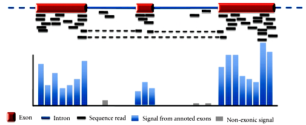
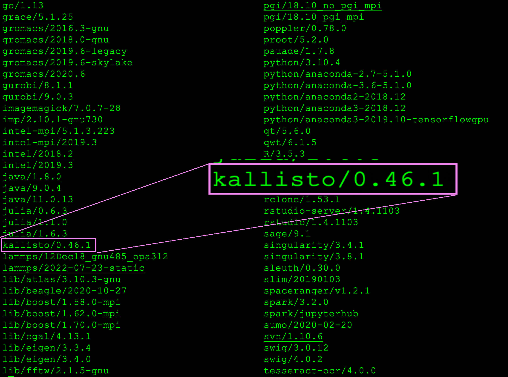
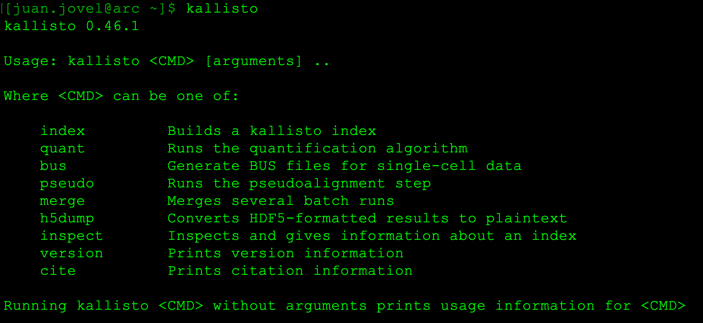

# Analysis of RNAseq data


---
## Introduction
A cell contains its DNA organised into chromosomes. A gene is a fragment of a chromosome that is converted into immature RNA and finally this latter is converted into a protein, which are the workhorses of cell biology.

But a gene is a mixture of exons and introns and only the exons code for proteins. So, introns have to be removed before the RNA is converted into a protein through a process called splicing. The RNA molecules that originate from DNA are dubbed ‘transcripts’.<br>

A single gene gives rise to several different proteins. In some cases, a single gene can give rise to dozens of different proteins through splicng. What happens is that a series of exons are shuffled to constitute different sequences. For examples a gene with a series of exons (1,2,3,4 and 5) could originate mature transcripts that contain only exons 1,2,4 and 5; 1 and 4, all on them, etc.<br>

A remarkable property of many eukaryotic transcripts is that they contain a tail of adenine nucleotides known as poly-A tail and a transcript is said to be polyadenylated. Because base pairs are complementary, adenine (A) pairs with thymine (T) and cytosine (C) pairs with guanine (G), by virtue of their hydrogen bonds number (2 in A-T and 3 in C-G), it is possible to use an artificial oligo of Ts to anneal it against the poly-A tail. Because oligo dT are conjugated with a heavy biotin molecule, or with paramagnetic beads, it is possible to selectively enrich poly-adenylated transcripts by pulling them down. A huge population of non-polyadenylated transcripts are ribosomal and other non-coding RNA, which are not of interest for gene expression studies, and they will be consequently depleted by enrichment of polyadenylated transcripts.<br>

Currently, in human and many model organisms, those individual transcripts have been mapped with high resolution to their corresponding genomes and therefore it is possible to individually quantify transcripts without the need of the genomic sequences. In this context, quantify means count how many molecules in our libraries correspond to each transcript, and that is assumed to be a proxy of gene expression. However, not all transcripts are expressed in all tissues, or under all conditions, so the survey of gene expression through RNAseq is always partial.

## RNAseq dana analysis

Bioinformatics analysis of RNAseq libraries entail essentially two steps:<br>
* Quantification of transcript abundance.
* Differential expression analysis.<br>
1. Quantification of transcript abundance

It can be done at least by two methods. In the traditional approach, or for organisms with transcriptomes poorly characterised, library reads are aligned against the genome of the corresponding organism and an auxiliary GTF or GFF3 file that contain description about genes and exons for genes.<br>

In recent years, and mostly for organisms with well-characterised transcriptomes like human, mouse, zebra fish, the nematode C. elegans, the fruit-fly, etc., well-annotated transcripts databases are available. The best database for genomes, transcriptomes, annotations and many additional tools is Ensembl (https://useast.ensembl.org/index.html). Ensembl has also an FTP server, from where full datasets can be accessed with ‘wget’ or ‘rsync’ (https://ftp.ensembl.org/pub/).<br>

The last version of Ensembl appears under the title ‘current’. Transcriptomes can be found under ‘current_fasta’ and inside it are organised by species. Inside each species directory, several datasets are found, the transcripts dataset is labelled as ‘cdna’ and the file of interest is the one with the suffix ‘cdna.all’ (For human, it will be Homo_sapiens.GRCh38.cdna.all.fa.gz).<br>

We can get the human transcriptome with the following command line:
```bash
wget https://ftp.ensembl.org/pub/current_fasta/homo_sapiens/cdna/Homo_sapiens.GRCh38.cdna.all.fa.gz
```
Uncompress transcriptome file downloaded:<br>
```bash
gunzip Homo_sapiens.GRCh38.cdna.all.fa.gz
```
Quantification of transcriptomes does not require bona fide alignments and can be achieve through an analogous method dubbed pseudo-alignment (https://tinyheero.github.io/2015/09/02/pseudoalignments-kallisto.html), and there are many tools for conducting pseudo-alignments. I prefer ‘kallisto’ (https://pachterlab.github.io/kallisto/about).<br>

The ARC cluster contains a large body of software centrally installed, which available to all users of the cluster. That list can be deployed with:
```bash
module avail
```


We can then load kallisto onto our working session with the following command:<br>
```bash
module load kallisto/0.46.1
```
Let's now explore the kallisto suite:
```bash
kallisto
```


The two most important programs are ‘index’ and ‘quant’, used, respectively, for indexing the transcriptome dataset and for quantifying the transcripts. To index the transcriptome:
```bash
kallisto index -i Homo_sapiens.GRCh38.cdna.all.idx Homo_sapiens.GRCh38.cdna.all.fa
```

Although the name of the indexed transcriptome is arbitrary, the convention is to use the original name, replacing the ‘fa’ extension by ‘idx’. Kallisto can run on compressed FASTQ files.

Run kallisto assuming files that end in _R1.fq.gz and _R2.fq.gz:

Create a variable that holds the path of the indexed transcriptome:
```bash
idx=/path/to/kallisto/index/Homo_sapiens.GRCh38.cdna.all.idx 
```

Run kallisto:
```bash
for FILE in *_R1.fq.gz; do kallisto quant -i $idx -o ${FILE/_R1.fq.gz/}_kallisto --bias -b 100 --threads 12 $FILE ${FILE/_R1/_R2}; done
```

A more complete list of kallisto commands can be found at: (https://pachterlab.github.io/kallisto/manual).

Now, we can write a bash script that parses the kallisto results and produces a table ready for differential expression analysis.


  

