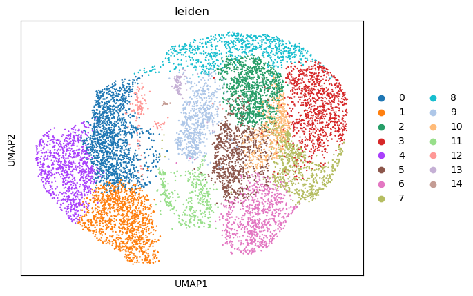
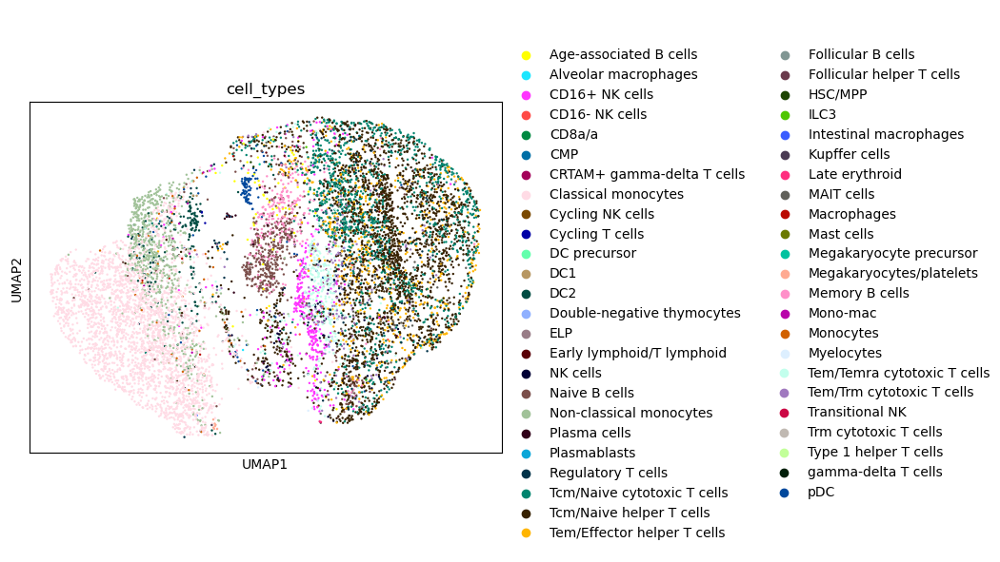
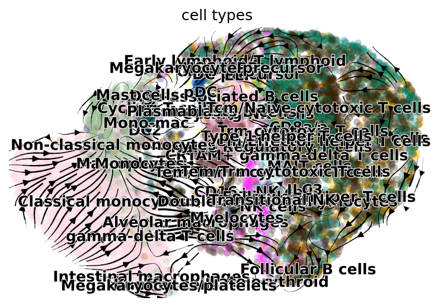
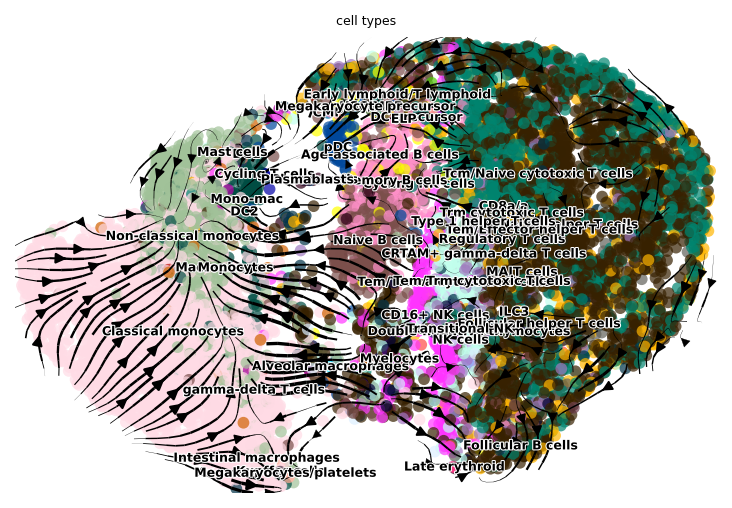
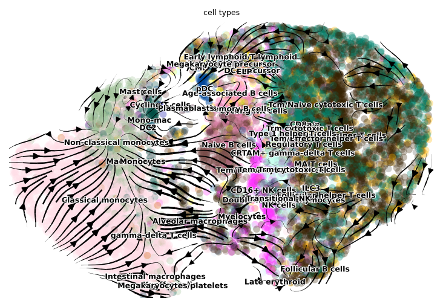
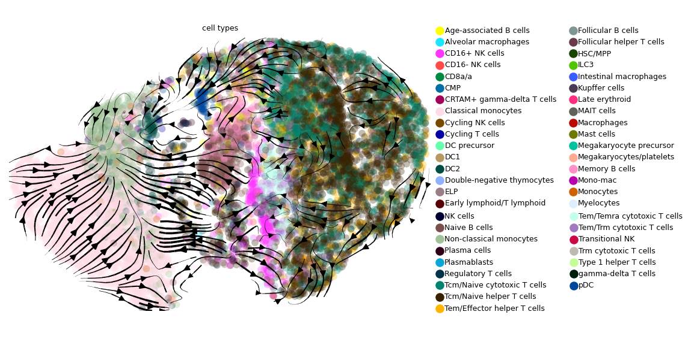

# RNA velocity
<br>
RNA velocity is a computational framework that allows inference of the future state of individual cells in single-cell RNAseq experiments. While RNAseq data provides a static snapshot of RNA transcription, it reveals little about dynamic processes that occur during development, or in response to stimuli. Addressing this challenge, La Manno and collaborators (2018) [1] introduced RNA velocity, leveraging the observation that nascent (unspliced) RNA exhibits different dynamics compared to mature (spliced) RNA. Based on the analysis of the ratio of spliced and unspliced RNA, the direction of a cell state transition is predicted in the high-dimension gene expression space, offering insights into cellular trajectories.<br><br>
At its core, RNA velocity models transcription activity using splicing kinetics equations, assuming steady state or dynamical models. However, such models can seem abstract. Here is a simpler analogy: Imagine observing a UMAP plot as a dynamic movie where cells move from one state to another over time. In this context, RNA velocity predicts those transitions. However, RNA velocity does not measure transcription directly but instead leverages comparison of unspliced and spliced RNA to make inferences.  
<br><br>
Unspliced molecules represent RNA that is being made; the higher this proportion the more active the transcription of particular types of genes. The steady state RNA (spliced) represents the pool of RNA already synthesized. Based on the first, the magnitude of the second can be calculated, and transitions can be predicted accordingly. A useful analogy is motion in physics, the steady state levels of RNA correspond to a cell’s current position, while nascent (unspliced) RNA reflects its acceleration. With these two components, RNA velocity calculates a cell’s future position (state) at time t + 1.
<br><br>
As it should be obvious, this method has multiple applications in diverse research areas, including: 

- Developmental biology: Stem-cell transitions into diverse cell types. 
- Cancer biology: Identifying cell types associated with more aggressive cancer. 
- Cellular reprogramming: Studying pluripotency or direct cell-type conversions.  
- Immune system dynamics: Unveiling immune cells dynamics in response to stimulation. 
- Gene regulatory networks: Identification of regulators of cell state transitions.  
- Disease progression and therapy: Unravelling cellular dynamics during therapy. 

## Computational pipeline
### Quantification

1. Create a new mamba environment with the required software 
   
```bash
mamba create -n RNAvel python=3.11 numpy=1.23 pandas=1.5 scanpy=1.9 pyroe salmon alevin-fry
mamba activate RNAvel
```

2. Download genome and GTF files 

```bash
# genome 
wget https://ftp.ensembl.org/pub/current_fasta/homo_sapiens/dna/Homo_sapiens.GRCh38.dna.toplevel.fa.gz 

# GTF 
wget https://ftp.ensembl.org/pub/current_gtf/homo_sapiens/Homo_sapiens.GRCh38.113.chr_patch_hapl_scaff.gtf.gz 
```
 
3. Create a spliced reference genome 

```bash
pyroe make-splici "$GENOME" "$GTF" 151 hs_GRCh38_113_splici_python --flank-trim-length 5 --filename-prefix splici 
```

The above command line will produce folder hs_GRCh38_113_splici_python  

Containing the following files:

```bash
clean_gtf.gtf  
gene_id_to_name.tsv  
missing_gene_id_or_name_records.gtf  
splici_fl146.fa  
splici_fl146_t2g_3col.tsv 
```
 
4. Generate file containing Ensembl and HGNC gene IDs 

```bash
# make gene ID to gene name mapping file
# generate Entrez gene ID to gene name mapping. 
# From Ensembl 

gffread Homo_sapiens.GRCh38.113.chr_patch_hapl_scaff.gtf -o Homo_sapiens.GRCh38.113.chr_patch_hapl_scaff.gff 

grep "gene_name" Homo_sapiens.GRCh38.113.chr_patch_hapl_scaff.gff | cut -f9 | cut -d';' -f2,3 | sed 's/=/ /g' | sed 's/;/ /g' | cut -d' ' -f2,4 | sort | uniq > hs_ensembl-ID_2_HGNC-ID.txt 
```
 
5. Generate salmon/alevin splici index 

```bash
# bash index_splici_genome.sh  
# to request more memory in a slurm file (16Gb) 

salmon index -t hs_GRCh38_113_splici_python/splici_fl146.fa -i hs_GRCh38_splici_fl146_idx  -p 16 
```
 
6. Mapping the data to obtain a RAD file 

```bash 
# We will be using sketch mode which uses pseudoalignment with structural  
# constraints to generate a RAD file  
# bash run_salmon.sh contains this code.

salmon alevin -i hs_GRCh38_splici_fl146_idx -p 16 -l ISR --chromium --sketch \ 
-1 ../Parent_NGSC3_DI_PBMC_fastqs/Parent_NGSC3_DI_PBMC_R1.fq.gz \ 
-2 ../Parent_NGSC3_DI_PBMC_fastqs/Parent_NGSC3_DI_PBMC_R2.fq.gz \ 
-o pbmc_splici_map 
```

### Post-processing: RNA velocity 

 Now that the spliced and unspliced quantification has been conducted, we are ready for the RNA velocity analysis with scVelo (an alternative approach is [velocyto https://velocyto.org/], still not tested by the author).

1. Installation of scVelo

Install scVelo (do it from source code as explained here). I run into trouble when installing using pip or mamba.

```bash
git clone https://github.com/theislab/scvelo.git
cd scvelo
pip install .
```

All post-processing steps were organized in a single python script (scVelo_withClustering-labelling.py). Hereafter we briefly describe the most important stepts.

The following python modules are required, make sure you already installed them:

```python
  import numpy as np
  import pandas as pd
  import scanpy as sc
  import anndata
  import scvelo as scv
  import matplotlib
  import scipy
  from pyroe import load_fry
  import os
  import scipy.sparse
  from celltypist import models, annotate
```

The first step is to import the results produced by alevin-fry which are in folder pbmc_splici_quant_res.

```python
  frydir = "pbmc_splici_quant_res"
  e2n_path = " hs_ensembl-ID_2_HGNC-ID.txt"
  adata = load_fry(frydir, output_format="velocity")
```

Few more python lines of code will allow generation of a scVelo plot:

```python
  # Load the transcript-to-gene mapping
  e2n = dict([l.rstrip().split() for l in open(e2n_path).readlines()])

  # Map gene IDs to gene names, using fallback for missing keys
  adata.var_names = [e2n.get(e, e) for e in adata.var_names]  # Use original gene ID if missing

  # Ensure gene names are unique
  adata.var_names_make_unique()

  # get embeddings
  sc.tl.pca(adata)
  sc.pp.neighbors(adata)
  sc.tl.tsne(adata)
  sc.tl.umap(adata, n_components=2)

  # housekeeping
  matplotlib.use('AGG')
  scv.settings.set_figure_params('scvelo')

  # get the proportion of spliced and unspliced count
  scv.utils.show_proportions(adata)

  # filter cells and genes, then normalize expression values
  scv.pp.filter_and_normalize(adata, min_shared_counts=20, n_top_genes=2000, enforce=True)

  # scVelo pipeline
  scv.pp.moments(adata, n_pcs=30, n_neighbors=30)
  scv.tl.recover_dynamics(adata, n_jobs=11)
  scv.tl.velocity(adata, mode='dynamical')
  scv.tl.velocity_graph(adata)
  adata.write('pbmc_full_dim_scvelo.h5ad', compression='gzip')
  scv.pl.velocity_embedding_stream(adata, basis='X_umap', save="pbmc_full_dim.png")
```

which produces the default scVelo plot for RNA velocity.


Figure 1. Basic plot generated by scVelo.

That image have several problems. The first one is that, although we see arrows representing trajectories of cells that transition into other cell states, nothing is seen about clusters colors and cell types.

We can modify the above script to include Leiden clustering:

```python
  sc.pp.normalize_total(adata, target_sum=1e4)  # Normalize counts per cell to 10,000
  sc.pp.log1p(adata)  # Log-transform the data
  sc.tl.leiden(adata, resolution=0.5)  # Adjust resolution for granularity
```

Leiden clusters can be used to produce a UMAP plot like this:



Figure 2. Leiden clusters.

Subsequently, celltypist [2,3] can be used to classify cells (to assign cell types). 

However, Leiden clusters are not used by celltypist to classify cell types, but gives us a first idea of the number of cell types (clusters) present in the dataset. Such clusters could also be used to manually annotate cell clusters, identifying markers by differential expression analysis, as exemplified in the workshop.

Celltypist maps the gene expression profile of individual cells in the query dataset to the reference model and uses this mapping to prefict the most probable cell type for each cell. 

A hybrid approach including manual annotation and celltypist annotations can be used too. It is, the leiden clusters could be manually annotated using the information provided by celltypist plus any other trustable source of information.

To use celltypist, first, download the machine learning models for cell classification.

```python
  from celltypist import models
  # Download all available models
  models.download_models()
```

Run the above commands in the python console. It will print the path in which the models were stored. It should be something like: '/home/<user>/.celltypist/data/models/'. Then use the corresponding model for cell classification:

```python
  # Load the model
  model_path = "/home/juan.jovel/.celltypist/data/models/Immune_All_Low.pkl"
  model = models.Model.load(model = model_path)
  predictions = annotate(adata, model)
  adata.obs["cell_types"] = predictions.predicted_labels
```

The newly-classified cell types can be saved or visualized before applying scVelo.

```python
  sc.pl.umap(adata, color="cell_types", save="_cell_types.png")
```


Figure 3. Cell types as defined by celltypist.

Finally, scVelo is run.

```python
  # filter cells and genes, then normalize expression values
  scv.pp.filter_and_normalize(adata, min_shared_counts=20, n_top_genes=2000, enforce=True)

  # scVelo pipeline
  scv.pp.moments(adata, n_pcs=30, n_neighbors=30)
  scv.tl.recover_dynamics(adata, n_jobs=11)
  scv.tl.velocity(adata, mode='dynamical')
  scv.tl.velocity_graph(adata)

  # Save the processed AnnData object
  adata.write('pbmc_full_dim_scvelo.h5ad', compression='gzip')
```

All the data contained in the scVelo object is saved in 'pbmc_full_dim_scvelo.h5ad'. If it needs to be further processed in the future, it can be imported back into python like this:

```python
  import scvelo as scv
  adata = scv.read('pbmc_full_dim_scvelo.h5ad')

  # Access examples:
  velocity_graph = adata.uns['velocity_graph']
  umap_coordinates = adata.obsm['X_umap']
  spliced_counts = adata.layers['spliced']
  latent_time = adata.obs['latent_time']
  ...
```

This produces a more interesting plot. However, cell type labels are too big and some of them overlap.



Figure 4. Cell types as defined by celltypist including scVelo trajectories.

The size of labels can be reduced by manually defining the fontsize:

```python
    scv.pl.velocity_embedding_stream(
    adata,
    basis="umap",
    color="cell_types",
    save="pbmc_velocity_stream_cell_types_defaults.png",
    legend_fontsize=6,
    fontsize=6  # Adjust fontsize (default is larger, reduce for smaller labels)
```



Figure 5. Cell types as defined by celltypist including scVelo trajectories, smaller font (size=6).

It is also possible to adjust the transparency of the plot to improve readability.

```python
  scv.pl.velocity_embedding_stream(
    adata,
    basis="umap",
    color="cell_types",
    save="pbmc_velocity_stream_cell_types_transparencyAdjusted.png",
    fontsize=6,
    legend_fontsize=6,
    alpha=0.7  # Reduce opacity for clarity
)
```



Figure 6. Cell types as defined by celltypist including scVelo trajectories, smaller font.

Labels of cell types could also be placed outside of the main UMAP plot.

```python
    scv.pl.velocity_embedding_stream(
    adata,
    basis="umap",
    color="cell_types",
    save="pbmc_velocity_stream_cell_types_namesOutside.png",
    legend_loc="right margin",  # Move legend to the right
    legend_fontsize=6,
    fontsize=6
    )
```



Figure 7. Cell types as defined by celltypist including scVelo trajectories, cell type labels outside.

Other modifications could also be assayed. 

Remember that the complete code is available in script  scVelo_withClustering-labelling.py. scVelo outputs a series of warning, if that wants to be prevented, the following command can be used.

```bash
  PYTHONWARNINGS=ignore python scVelo_withClustering-labelling.py
```

If you have questions, don't hesitate in contacting me: juan.jovel@ucalgary.ca

### References

1. La Manno, G., Soldatov, R., Zeisel, A. et al. RNA velocity of single cells. Nature 560, 494–498 (2018). https://doi.org/10.1038/s41586-018-0414-6 

2. Domínguez Conde C, Xu C, Jarvis LB. et al. Cross-tissue immune cell analysis reveals tissue-specific features in humans. Science. 2022 May 13;376(6594):eabl5197. doi: 10.1126/science.abl5197. 

3. Xu C, Prete M, Webb S, Jardine L, Stewart BJ, Hoo R, He P, Meyer KB, Teichmann SA. Automatic cell-type harmonization and integration across Human Cell Atlas datasets. Cell. 2023 Dec 21;186(26):5876-5891.e20. doi: 10.1016/j.cell.2023.11.026. PMID: 38134877.  

 


