# Shotgun Metagenomics Analysis Pipeline Tutorial

## Overview

This tutorial provides a complete, step-by-step guide for analyzing shotgun metagenomics data. The pipeline takes you from raw sequencing reads through quality control, taxonomic classification, functional profiling, and statistical analysis. All commands can be copied and pasted directly into your terminal. When appropriate, clear instructions are given to execute Python or R scritps.

### What You'll Learn
- Quality assessment and control of metagenomic reads
- Host DNA removal from microbiome samples
- Taxonomic classification and abundance estimation
- Functional profiling of microbial communities
- Diversity analysis and statistical comparisons
- Data visualization and interpretation

### Prerequisites
- Basic command line knowledge
- Access to a high-performance computing cluster with SLURM
- Conda/Mamba package manager installed

## Pipeline Overview

The complete pipeline consists of 14 steps:

1. **Quality Control** - Initial assessment with FastQC/MultiQC
2. **Adapter Removal** - Remove sequencing adapters with Cutadapt
3. **Low Quality Filtering** - Filter poor quality sequences with Prinseq
4. **Host Removal** - Remove host DNA contamination with BMTagger
5. **Post-filtering QC** - Quality assessment after filtering
6. **Taxonomic Classification** - Classify reads with Kraken2/Bracken
7. **Functional Profiling** - Metabolic pathway analysis with HUMAnN
8. **HUMAnN Post-processing** - Normalize and regroup functional data
9. **Data Merging** - Combine sample results
10. **Data Filtering** - Remove low-abundance features
11. **Taxa Parsing** - Extract taxonomic levels
12. **Diversity Analysis** - Alpha and beta diversity with R
13. **Differential Abundance Analysis (DESeq2)** - Statistical testing with R
14. **Statistical Analysis (metagenomeSeq)** - Alternative statistical approach

---

## Environment Setup

### 1. Create Conda Environment

First, create the main analysis environment:

```bash
# Create environment from YAML file
mamba env create -f shotgun2025.yaml

# Activate environment
conda activate shotgun2025
```
NOTE: It is possible that, depending on the configuration of your user in ARC, some software might fail to install during the previous step. If that happens, you can create an additional mamba/conda environment for that app. Let's assume that cutadapt failed to install. Do the following:

```bash
mamba create -n cutadapt cutadapt
```

Make sure you activate the environment, ideally right before you call the software.

### 2. Directory Structure

Set up your working directory:

```bash
# Create main project directory
mkdir -p shotgun2025
cd shotgun2025

# Create subdirectories
mkdir -p {data,scripts}

cp /work/vetmed_shared_dbs/shotgun_workshop_2025/data/*fq ./data

cp /work/vetmed_shared_dbs/shotgun_workshop_2025/scripts/* ./scripts/

```

---

## Step 1: Initial Quality Control

### Purpose
Assess the quality of raw sequencing reads to identify potential issues before processing.

###### Script: `01_raw_fastqc_multiqc.sh`

### How to Run

```bash

# Submit to SLURM
sbatch scripts/01_raw_fastqc_multiqc.sh

# Check job status
squeue -u $USER

# View results
ls output/01_raw_fastqc/
ls output/01_raw_multiqc/
```

### Expected Output

- Individual FastQC reports for each sample
- Aggregated MultiQC report showing quality metrics across all samples
- HTML report viewable in web browser

Figure 1. Typical fastqc and multiqc results files.

<div align="center">
  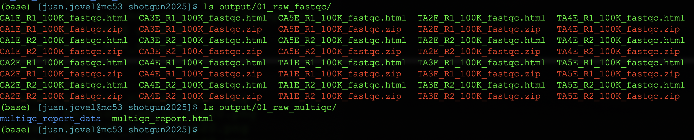
</div>

If you don't get the expected results, you can inspect the corresponding log files.

Figure 2. Log files corresponding to the run of fastqc and multiqc.

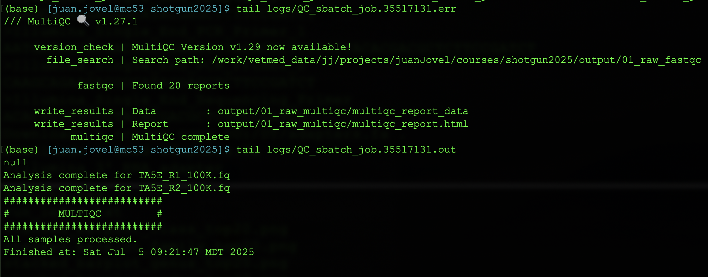


---

## Step 2: Adapter Removal

### Purpose
Remove sequencing adapters and perform quality trimming to improve data quality.

###### Script: `02_cutadapt.sh`

### How to Run

```bash
# Submit job
sbatch scripts/02_cutadapt.sh

# Monitor progress
tail -f logs/cutadapt_sbatch_job.*.out
```

---

## Step 3: Low Complexity Filtering

### Purpose
Remove low-complexity sequences and apply additional quality filters using Prinseq.

###### Script: `03_prinseq.sh`

### How to Run

```bash
# Make sure prinseq-lite.pl is in the scripts directory

# Submit job
sbatch scripts/03_prinseq.sh
```
---

## Step 4: Host DNA Removal

### Purpose
Remove host contamination (mouse reads) from microbiome samples using BMTagger.

###### Script: `04_bmtagger.sh`

### How to Run

```bash
sbatch scripts/04_bmtagger.sh
```

### Database Requirements
BMTagger requires pre-built host reference databases. For mouse samples, you need:
- `mice_reference.bitmask` - BMFilter index
- `mice_reference.srprism` - SRPrism index

---

## Step 5: Post-Host-Removal Quality Control

### Purpose
Assess data quality after host removal to ensure successful filtering.

###### Script: `05_bmtagger_fastqc_multiqc.sh`

### How to Run

```bash
sbatch scripts/05_bmtagger_fastqc_multiqc.sh

# Check results
ls output/05_bmtagger_multiqc/multiqc_report.html
```

---

## Step 6: Taxonomic Classification

### Purpose
Classify reads taxonomically and estimate abundance using Kraken2 and Bracken.

###### Script: `06_kraken_bracken_5.sh`

### How to Run

```bash
sbatch scripts/06_kraken_bracken_5.sh

# View Krona plots (final results)
ls output/06_Kr-Br-html_reports/all_krona_plots.html
```

### Database Requirements
Requires pre-built Kraken2 database. The script assumes access to a shared database, but you can build your own:

This is the longest process run in this pipeline. If you want to check progress inspect the log files, as illustrated below.

Figure 3. Log files for the kraken2-bracken run.

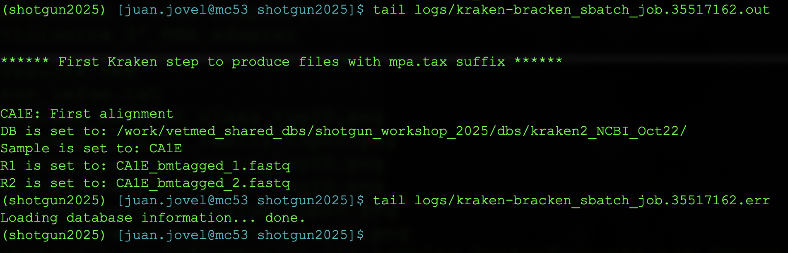

Results generated by this script are also copious.

Figure 4. Results generated by kraken-bracken script.

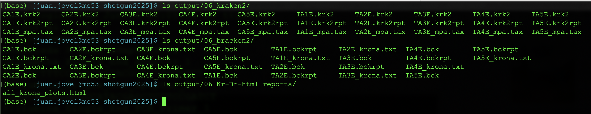

Figure 5. MPA-style taxonomic classification generated by Kraken2 per sample.

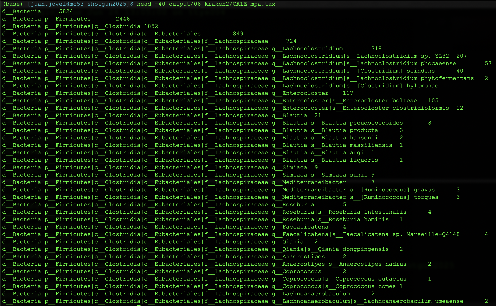

Transfer file `output/06_Kr-Br-html_reports/all_krona_plots.html` to your local computer. If you open that file in your favorite web browser, you will see this.

Figure 6. Krona plots generated by the kraken-bracken run.

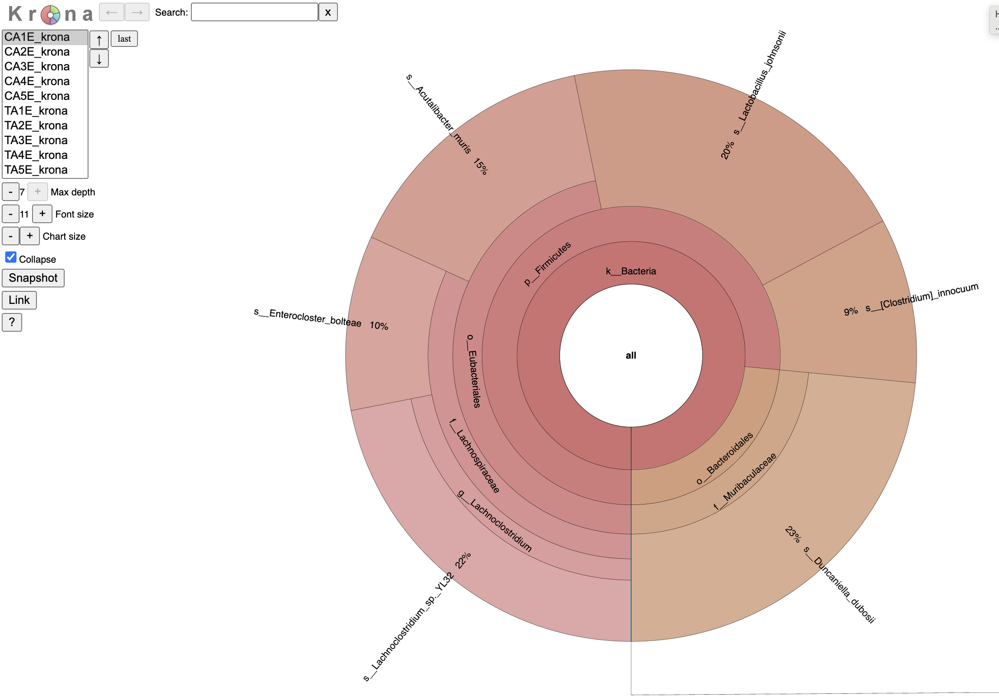

Or you can use this file to directly explore it in your favorite browser.

[krona file](images/all_krona_plots.html)

---

## Step 7: Functional Profiling

### Purpose
Analyze metabolic pathways and gene families using HUMAnN.

###### Script: `07_humann_multiple_samples.sh`

### How to Run

```bash
# Submit array job (processes multiple samples in parallel)
sbatch scripts/07_humann_multiple_samples.sh

# Check array job status
squeue -u $USER
```
If completed successfully, humann3 should generate the following results.

Figure 7. Results generated by humann3.

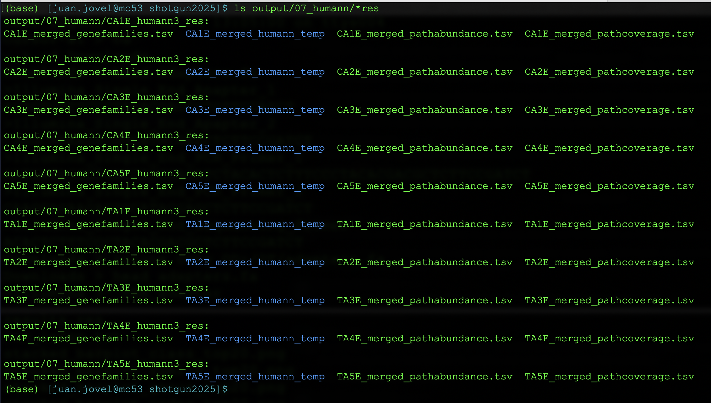


---

## Step 8: HUMAnN Post-processing

### Purpose
Normalize, regroup and rename HUMAnN output for downstream analysis.

###### Script: `08_postprocessing_humann3.sh`

### How to Run

```bash
# Create a directory to store all genefamilies results generated by humann3.
mkdir output/humann3_geneFamilies

cd output/humann3_geneFamilies/

# Create symbolic links for each genefamilies file
for FILE in ../07_humann/*res/*genefamilies.tsv; do ln -s $FILE; done

# Make script executable and run
chmod +x ../../scripts/08_postprocessing_humann3.sh
../../scripts/08_postprocessing_humann3.sh

cd ../../
```
If successfully run, your results should look like this.

Figure 8. Results obtained after postprocessing humann3 results.

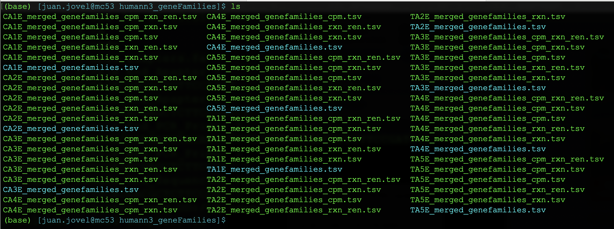

### Output Files Explanation
- `*_genefamilies.tsv`: Raw gene family abundances
- `*_genefamilies_cpm.tsv`: Normalized gene families (CPM)
- `*_genefamilies_rxn.tsv`: Gene families regrouped to reactions
- `*_genefamilies_rxn_ren.tsv`: Final regrouped and renamed files

---

Figure 9. A typical humann3 table of reactions renamed.
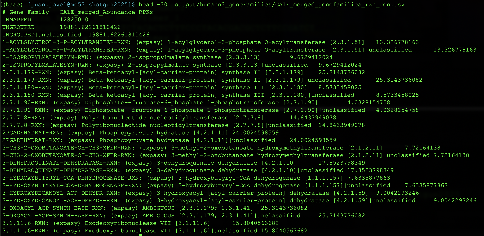

## Step 9: Data Merging

Kraken2 taxonomic classification tables, as well as postprocessed humann3 tables are generated per sample. However, for postprocessing of that data, it is conveniente to have all samples in a single table. For that purpose, you can use script `09_merge.py`.

### Purpose
Combine individual sample results into unified tables for analysis.

The merge script is provided and should be used as follows:

### How to Run

```bash
# For kraken2 results
# Navigate to Kraken results directory
cd output/06_kraken2/

# Merge MPA-style taxonomic profiles
python ../../scripts/09_merge.py *_mpa.tax | sed 's/_mpa//g'  > ../../merged_taxonomy_table.tsv

# Return to main directory
cd ../../

# Inspect results
head merged_taxonomy_table.tsv

# For humann3 results
# Navidate to the genefamiles results
cd output/humann3_geneFamilies/

# Merge *_genefamilies_rxn_ren.tsv tables
python ../../scripts/09_merge.py *_genefamilies_rxn_ren.tsv | sed 's/_merged_genefamilies_rxn_ren//g' >  ../../merged_genefamilies_rxn_ren.tsv

# Return to main directory
cd ../../

# Inspect results
head merged_genefamilies_rxn_ren.tsv
```
---

## Step 11: Taxa Parsing

### Purpose
Extract specific taxonomic levels from the merged taxonomy table for level-specific analysis.

###### Script: `11_parse_taxa.py`

### How to Run

```bash
# Parse your filtered taxonomy table
python scripts/11_parse_taxa.py merged_taxonomy_table.tsv
```

This script will generate separate files for each taxonomic level:
- `merged_taxonomy_table_level_1.tsv` (Kingdom)
- `merged_taxonomy_table_level_2.tsv` (Phylum)
- `merged_taxonomy_table_level_3.tsv` (Class)
- `merged_taxonomy_table_level_4.tsv` (Order)
- `merged_taxonomy_table_level_5.tsv` (Family)
- `merged_taxonomy_table_level_6.tsv` (Genus)
- `merged_taxonomy_table_level_7.tsv` (Species)

Now let's generate a metadata file that we will need for the next section (posrprocessing of count data).

```bash
# Create metadata file
cat > metadata.txt << 'EOF'
SampleID	group	label
CA1E	Control	CA1E
CA2E	Control	CA2E
CA3E	Control	CA3E
CA4E	Control	CA4E
CA5E	Control	CA5E
TA1E	Treatment	TA1E
TA2E	Treatment	TA2E
TA3E	Treatment	TA3E
TA4E	Treatment	TA4E
TA5E	Treatment	TA5E
EOF
```

Now it is time to transfer our tables to the local computer. 

```bash
mkdir files2transfer
mv merged_genefamilies_rxn_ren.tsv files2transfer
mv merged_taxonomy_table.tsv files2transfer
mv merged_taxonomy_table_level_*.tsv files2transfer
mv metadata.txt files2transfer
cp scripts/*R files2transfer
zip -r files2transfer.zip files2transfer/
```
Now you can transfer `files2transfer.zip` to your local computer.

---

## Now we are in the local computer

After transfering file `files2transfer.zip` to the local computer and decompressing it, you should see the following content.

Figure 10. Content of the local shotgun2025 directory to start postprocessing count data.

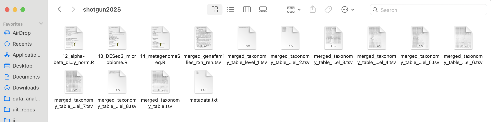
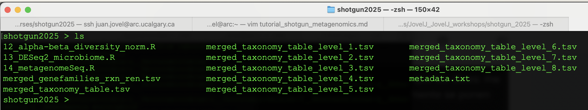

## Step 12: Alpha and Beta Diversity Analysis

### Purpose
Analyze microbial diversity within samples (alpha) and between samples (beta), with statistical testing and visualization.

### Script: `12_alpha-beta_diversity_norm.R`

This comprehensive R script performs:
- Alpha diversity calculations (Shannon, Simpson, Chao1, etc.)
- Beta diversity analysis (PCoA with multiple distance metrics)
- Statistical testing (PERMANOVA, ANOSIM)
- Stacked bar plots of most abundant taxa
- Analysis across all taxonomic levels

### Required R packages

```r
# Install required packages if not already installed
if (!require("BiocManager", quietly = TRUE))
    install.packages("BiocManager")

BiocManager::install("phyloseq")
install.packages(c("tidyverse", "vegan", "RColorBrewer"))

# If vegan installation fails, try:
# remotes::install_github("vegandevs/vegan")
```

### How to Run


### Key Features of the Script

1. **Taxonomic Level Processing**: Analyzes all 7 taxonomic levels automatically
2. **Alpha Diversity Metrics**:
   - Observed species richness
   - Chao1 estimator
   - ACE estimator
   - Shannon diversity
   - Simpson diversity
   - Inverse Simpson

3. **Beta Diversity Analysis**:
   - Bray-Curtis dissimilarity
   - Jaccard distance
   - Jensen-Shannon divergence
   - PCoA visualization with statistical testing

4. **Statistical Testing**:
   - PERMANOVA for testing group differences
   - ANOSIM for alternative group testing
   - Automated p-value reporting

5. **Visualization**:
   - Box plots for alpha diversity metrics
   - PCoA plots with group coloring and statistics
   - Stacked bar plots showing top 20 most abundant taxa

### Expected Output Files

The script generates multiple files for each taxonomic level and analysis:

**Alpha Diversity Plots**:
- `alpha_diversity_kingdom_Observed.png`
- `alpha_diversity_kingdom_Shannon.png`
- `alpha_diversity_phylum_Observed.png`
- etc.

**Beta Diversity Plots**:
- `pcoa_kingdom_bray_with_stats.png`
- `pcoa_phylum_jaccard_with_stats.png`
- etc.

**Stacked Bar Plots**:
- `stacked_barplot_phylum_top20.png`
- `stacked_barplot_genus_top20.png`
- etc.

### Understanding the Output

1. **Alpha Diversity**: Higher values generally indicate more diverse communities
2. **Beta Diversity**: PCoA plots show sample relationships - closer points are more similar
3. **Statistical Results**: 
   - PERMANOVA p < 0.05 indicates significant group differences
   - ANOSIM R values: 0 = no difference, 1 = complete separation
4. **Stacked Bar Plots**: Show relative abundance of most abundant taxa across samples

---

## Step 13: Differential Abundance Analysis with DESeq2

### Purpose
Identify significantly different microbial features between experimental groups using DESeq2's robust statistical framework.

### Script: `13_DESeq2_microbiome.R`

This script performs:
- Differential expression analysis adapted for microbiome data
- Hierarchical clustering and PCoA visualization
- Volcano plot generation
- Excel export of results

### Required R Packages

```r
# Install DESeq2 and dependencies
if (!require("BiocManager", quietly = TRUE))
    install.packages("BiocManager")

BiocManager::install("DESeq2")

# Install other required packages
install.packages(c("ecodist", "RColorBrewer", "pheatmap", "vegan", "ggplot2"))
```

### Input Files Required

The script expects two input files:

1. **Count Data**: `inflammation_all_samples_kraken2-counts.tsv`
   - Rows = microbial features (taxa)
   - Columns = samples
   - Values = raw counts

2. **Metadata**: `metadata.txt`
   - Must contain columns: sample names, group information
   - Tab-separated format

### Create the Metadata File

```bash
# Create metadata file for the inflammation study
cat > metadata.txt << 'EOF'
	group	label
CA1E	01_Control	CA1E
CA2E	01_Control	CA2E
CA3E	01_Control	CA3E
CA4E	01_Control	CA4E
CA5E	01_Control	CA5E
TA1E	02_DSS	TA1E
TA2E	02_DSS	TA2E
TA3E	02_DSS	TA3E
TA4E	02_DSS	TA4E
TA5E	02_DSS	TA5E
EOF
```

### How to Run

```bash
# Make sure input files are in the working directory
ls inflammation_all_samples_kraken2-counts.tsv metadata.txt

# Run DESeq2 analysis
Rscript scripts/13_DESeq2_microbiome.R
```

### Key Features of the Script

1. **Data Preprocessing**:
   - Converts to integer counts (required by DESeq2)
   - Adds pseudocount of 1 to handle zeros
   - Creates DESeq2 data object

2. **Exploratory Analysis**:
   - Regularized log transformation (rlog) for visualization
   - Hierarchical clustering with Bray-Curtis distance
   - Principal Coordinates Analysis (PCoA)

3. **Differential Analysis**:
   - Uses geometric mean for size factor estimation
   - Fits negative binomial model
   - Multiple testing correction (Benjamini-Hochberg)

4. **Visualization**:
   - Sample distance heatmap
   - PCoA plot with group coloring
   - Volcano plot highlighting significant features

5. **Results Export**:
   - Multiple significance thresholds (p < 0.1, 0.05, 0.01)
   - Normalized count data included
   - Tab-separated output files

### Expected Output Files

**Statistical Results**:
- `inflammation_all_samples_kraken2-counts_p0.1_DE_features.tsv`
- `inflammation_all_samples_kraken2-counts_p0.05_DE_features.tsv`
- `inflammation_all_samples_kraken2-counts_p0.01_DE_features.tsv`
- `inflammation_all_samples_kraken2-counts_allRes_normData.tsv`

**Visualization Files**:
- `inflammation_all_samples_kraken2-counts_HCheatmap.pdf`
- `inflammation_all_samples_kraken2-counts_PCoA.pdf`
- `inflammation_all_samples_kraken2-counts_volcanoPlot.pdf`

### Interpreting Results

1. **Log2 Fold Change**: 
   - Positive values = higher in Treatment group
   - Negative values = higher in Control group
   - |log2FC| > 1 indicates 2-fold change

2. **Adjusted p-values (padj)**:
   - < 0.05 = statistically significant
   - Controls for multiple testing

3. **Volcano Plot Colors**:
   - Red: Significantly higher in treatment (padj < 0.05, log2FC > 1)
   - Green: Significantly lower in treatment (padj < 0.05, log2FC < -1)
   - Blue: Significant but small fold change
   - Gray: Large fold change but not significant
   - Black: Not significant

### Example Results Interpretation

```bash
# View top significant results
head -20 inflammation_all_samples_kraken2-counts_p0.05_DE_features.tsv

# Count significant features
wc -l inflammation_all_samples_kraken2-counts_p0.05_DE_features.tsv
```

---

## Step 14: Statistical Analysis with metagenomeSeq

### Purpose
Alternative statistical analysis using metagenomeSeq's zero-inflated Gaussian model, specifically designed for sparse microbiome data.

### Script: `14_metagenomeSeq.R`

This script provides:
- CSS (Cumulative Sum Scaling) normalization
- Zero-inflated Gaussian model fitting
- Advanced visualization options
- Multiple statistical approaches for microbiome data

### Required R Packages

```r
# Install metagenomeSeq and dependencies
if (!require("BiocManager", quietly = TRUE))
    install.packages("BiocManager")

BiocManager::install("metagenomeSeq")

# Install other packages
install.packages(c("tidyverse", "reshape2", "RColorBrewer", "pheatmap", "ggrepel"))
```

### How to Run

```bash
# Ensure input files are available
ls inflammation_all_samples_kraken2-counts.tsv metadata.txt

# Run metagenomeSeq analysis
Rscript scripts/14_metagenomeSeq.R
```

### Key Features of the Script

1. **Data Import and Setup**:
   - Loads count and metadata files
   - Creates MRexperiment object (metagenomeSeq format)
   - Validates data consistency

2. **Data Exploration**:
   - Basic statistics (features, samples, sparsity)
   - Data quality assessment

3. **Filtering**:
   - Removes low-abundance features
   - Configurable presence and depth thresholds
   - Reports filtering statistics

4. **Normalization**:
   - CSS (Cumulative Sum Scaling) normalization
   - Calculates and reports normalization factors
   - Generates normalized count matrix

5. **Statistical Analysis**:
   - Zero-inflated Gaussian (ZIG) model
   - Differential abundance testing
   - Multiple testing correction

6. **Advanced Visualization**:
   - PCA with variance explained
   - Heatmap of most variable features
   - Multiple volcano plot solutions for overlapping points
   - Box plots of significant features

### Unique Features of metagenomeSeq

1. **CSS Normalization**: Designed specifically for microbiome data sparsity
2. **Zero-Inflation Handling**: Explicitly models excess zeros common in microbiome data
3. **Robust Statistics**: Less sensitive to outliers than standard methods

### Expected Output Files

**Statistical Results**:
- `differential_abundance_results.csv` - Complete results table
- `normalized_counts.csv` - CSS-normalized count matrix

**Visualization Outputs**:
- PCA plot with group separation
- Heatmap of top 50 most variable features
- Multiple volcano plot variations
- Box plots of top significant features

### Volcano Plot Solutions

The script provides four different approaches to handle overlapping points in volcano plots:

1. **Jitter Method**: Adds small random offsets
2. **Position Jitter**: Uses ggplot2's position_jitter
3. **ggrepel Labels**: Adds non-overlapping labels
4. **Large Transparent Points**: Uses transparency to show density

### Interpreting metagenomeSeq Results

1. **Log2 Fold Change**: Similar to DESeq2 interpretation
2. **Adjusted p-values**: Multiple testing corrected p-values
3. **Taxa Information**: Includes full taxonomic classification
4. **Normalization Factors**: Shows sample-specific scaling factors

### Comparison with DESeq2

| Feature | DESeq2 | metagenomeSeq |
|---------|--------|---------------|
| Model | Negative Binomial | Zero-Inflated Gaussian |
| Normalization | Geometric Mean | CSS |
| Zero Handling | Implicit | Explicit |
| Best For | RNA-seq adapted | Microbiome-specific |

### Running Both Analyses

```bash
# Run both statistical approaches for comprehensive analysis
Rscript scripts/13_DESeq2_microbiome.R
Rscript scripts/14_metagenomeSeq.R

# Compare results
echo "DESeq2 significant features:"
wc -l inflammation_all_samples_kraken2-counts_p0.05_DE_features.tsv

echo "metagenomeSeq results available in:"
ls differential_abundance_results.csv
```

---

## Complete Pipeline Summary

### Quick Start Commands

```bash
# 1. Setup environment
conda activate shotgun2025
mkdir -p shotgun_analysis/{data,scripts,output,logs}
cd shotgun_analysis

# 2. Quality control
sbatch scripts/01_raw_fastqc_multiqc.sh

# 3. Read processing
sbatch scripts/02_cutadapt.sh
sbatch scripts/03_prinseq.sh
sbatch scripts/04_bmtagger.sh
sbatch scripts/05_bmtagger_fastqc_multiqc.sh

# 4. Taxonomic classification
sbatch scripts/06_kraken_bracken_5.sh

# 5. Functional profiling
sbatch scripts/07_humann_multiple_samples.sh
./scripts/08_postprocessing_humann3.sh

# 6. Data merging and filtering
python scripts/09_merge.py output/06_kraken2/*_mpa.tax > merged_taxonomy.tsv
./scripts/10_filter_by_average.sh merged_taxonomy.tsv 0.01 > filtered_taxonomy.tsv
python scripts/11_parse_taxa.py filtered_taxonomy.tsv

# 7. Statistical analysis
Rscript scripts/12_alpha-beta_diversity_norm.R
Rscript scripts/13_DESeq2_microbiome.R
Rscript scripts/14_metagenomeSeq.R
```

### Troubleshooting Common Issues

1. **Database Path Errors**: Update database paths in scripts to match your system
2. **Memory Issues**: Increase memory allocation in SLURM headers
3. **Conda Environment**: Ensure all required packages are installed
4. **File Permissions**: Make scripts executable with `chmod +x`
5. **Array Jobs**: Adjust array indices based on your sample count

### Key Output Files for Publication

1. **Quality Metrics**: MultiQC reports from steps 1 and 5
2. **Taxonomic Composition**: Krona plots from step 6
3. **Diversity Analysis**: All plots from step 12
4. **Statistical Results**: Significant features from steps 13-14
5. **Functional Profiles**: HUMAnN pathway abundances from steps 7-8

This complete pipeline provides a robust framework for shotgun metagenomics analysis, from raw reads to publication-ready results. Each step builds upon the previous ones, creating a comprehensive analysis workflow suitable for various microbiome research questions.
